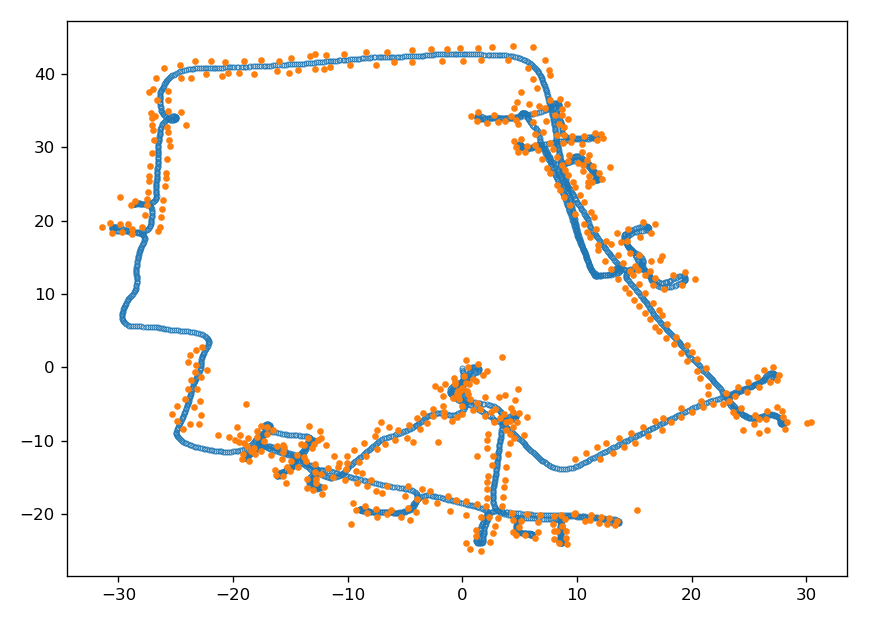
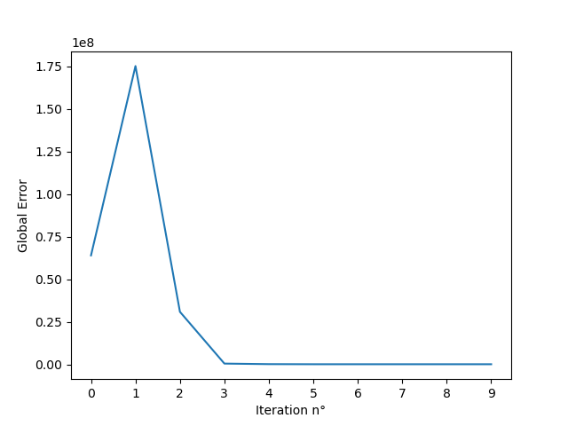

# **Graph-SLAM implementation**

The following is a documented presentation of a Graph-SLAM implementation based on the course ["Mobile Sensing and Robotics 2"](https://www.ipb.uni-bonn.de/msr2-2020/) given by Cyrill Stachniss at the University of Bonn. The dataset used for in this example has been provided in the same course. A formal theoretical explanation can be found in the [relative paper](http://www2.informatik.uni-freiburg.de/~stachnis/pdf/grisetti10titsmag.pdf). This aims to be a more informal approach for explaining theory behind the same algorithm. 

## **Why SLAM?**

SLAM stands for **S**imultaneous **L**ocalization **A**nd **M**apping. Once a robot is placed in a new environment it needs to localize itself and create a map of the surrounding (useful for performing future activities such as path planning). 

Usually SLAM algorithms are used in scenarios where the pose and the map of the robot is not known. The only information available are the **controls** *u* coming from odometry measurements (for example an encoder attached to the motor axis) and the **measurement** *z* taken at each pose (for example with respect to a landmark in the scene).

There are different implementation of SLAM algorithms, one of the main distinction to be made is between ***Online SLAM*** and ***Full SLAM***. The former is the process of estimating only the current pose and map given all the known control, and measurements. The later tries to optimize also all the posterior poses along with the map. The Graph-based SLAM implementation tries to solve a Full SLAM.

Solving a SLAM problem is a difficult task, depending on the quality of the odometry system, control measurements are far from being perfect, this leads to a probabilistic approach to the problem. When considering an odometry measurement, we are going to consider also the information matrix (covariance matrix) related to it.The covariance matrix that takes express the probability distribution of the measurement taken (better the measurement system, smaller the probability distribution).

In the so called ***Graph-Based SLAM*** approach, we construct a graph where each **node** is represented by a pose of the robot or a landmark in the environment, **edges** between nodes constrain the system. Edges can be given by odometry measurement or sensor measurements. Virtual measurement can be deduced from observing the same feature in the environment and triangulate the position of the robot based on that. This last step is possible thanks to ICP(Iterative Closest Point) algorithms. Usually sensor scan sensors have smaller covariance matrix when compared to odometry sensors (to be trusted more).

